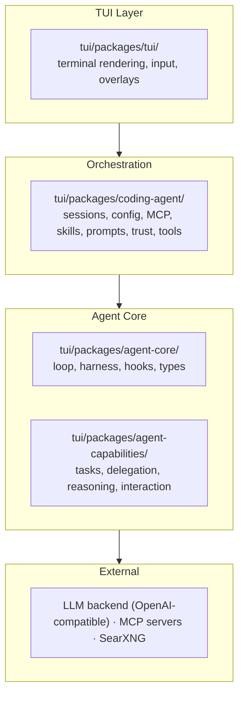
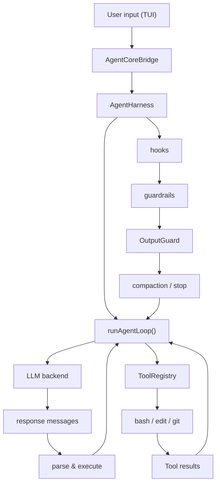

# Logician

[](https://nodejs.org)
[](https://bun.sh)
[](https://typescriptlang.org)
[](LICENSE)

<picture>
  <source media="(prefers-color-scheme: dark)" srcset="logo/logician-banner.svg">
  
</picture>


A local-first coding agent with a streaming terminal UI. SSH-ready, thinking-visible, and built for real code editing workflows.

Logician turns natural-language instructions into verified code changes — with full reasoning trace, session persistence, and skill-based extensibility. No cloud dependency, no black-box prompts.

## Install

### Binary (recommended)

```bash
curl -fsSL https://raw.githubusercontent.com/lseman/logician/main/tui/install.sh | bash
```

Supports macOS and Linux on `x86_64` and `arm64`. Pin a version:

```bash
curl -fsSL https://raw.githubusercontent.com/lseman/logician/main/tui/install.sh | bash -s -- 0.3.0
```

### From source

```bash
cd tui
bun install
bun start
```

### Requirements

| Requirement | Details                           |
| ----------- | --------------------------------- |
| Node.js     | `>=22.19.0` (or Bun `>=1.3.14`)  |
| LLM backend | OpenAI-compatible API             |
| `rg`, `fd`  | Optional — speeds up search tools |
| SearXNG     | Optional — powers `web_search`    |
| MCP servers | Optional — extend tool surface    |

## Quick Start

Run the TUI. It connects to an OpenAI-compatible backend at `http://127.0.0.1:8080` by default. Configure in `.logician.json` or via `LOGICIAN_LLM_URL`.

```
/ Enter commands  ·  Ctrl+Enter steer  ·  Ctrl+O tools
```

### Keyboard shortcuts

Shortcuts below change runtime settings immediately — no restart, no config edit.

| Shortcut | Effect |
| --- | --- |
| `Ctrl+L` | Open model selector |
| `Ctrl+G` | Jump to a file from the current working set |
| `Ctrl+O` | Expand/collapse tool execution details |
| `Alt+J` / `Alt+K` | Move focus between tool cards |
| `Alt+Enter` | Toggle the focused tool card |
| `Ctrl+Shift+T` | Cycle thinking display mode (collapsed → summary → expanded) |
| `Ctrl+S` | Open session manager |
| `Ctrl+K` | Cycle sandbox mode (off → code → full) |
| `Ctrl+P` | Toggle plan mode (plan ↔ act) |
| `Ctrl+Enter` | Submit as immediate steering, or flush the steering queue |
| `Ctrl+M` / `Alt+M` | Cycle inference mode |
| `Ctrl+I` | Cycle execution profile (autonomous ↔ minimal) |

### Development

```bash
cd tui
bun run dev        # start dev server
bun run typecheck  # TypeScript check
bun run test       # run tests
bun start -- doctor --json  # read-only readiness report
bun start -- exec --jsonl "fix the failing test"  # headless JSONL stream
```

`doctor` inspects configuration, local dependencies, MCP declarations, skills,
permissions, and sandbox capability without contacting the configured model or
starting MCP servers. Omit `--json` for a compact human-readable report.

`exec --jsonl` keeps stdout machine-readable with versioned content, tool,
error, terminal metadata, and `done` records. Diagnostics go to stderr, and
reasoning tokens are not included in the stream.

## Features

- **Terminal-native** — works over SSH, in tmux, in any VT100-compatible terminal
- **Streaming responses** — see reasoning, tool progress, and results as they happen
- **Safe edits** — strict text matching, CRLF/BOM preservation, path normalization
- **Skills & plugins** — `SKILL.md`-driven capabilities, Claude-style lifecycle hooks
- **Subagents** — delegate to child agents with isolated worktrees
- **Structured reasoning** — SSR, Tree of Thoughts, Reflexion, and more
- **Session management** — persistence, bookmarks, branching, rewind checkpoints, compaction
- **Cross-session memory** — persistent observations, lessons, and action tracking
- **MCP support** — stdio and streamable HTTP MCP servers
- **Permission modes** — `acceptAll`, `acceptEdits`, `ask`, `plan`

## Architecture

Logician is a TypeScript monorepo with four packages under `tui/packages/`. The TUI sits on top, connecting the user to the agent engine through an orchestration layer.



### Data flow



1. **TUI** collects input, renders the transcript, and manages overlays (permissions, session browser, settings).
2. **AgentCoreBridge** (in `coding-agent`) wires the bridge between the TUI and `agent-core`. It resolves configuration, loads MCP servers, registers tools, and translates agent events to TUI display formats.
3. **AgentHarness** runs the main loop: receive user input → call backend → parse response → execute tools → repeat. Each iteration is a "turn" with lifecycle events (`turn_start`, `tool_call`, `tool_result`, `turn_end`).
4. **Hooks** intercept every event via a `HookBus` with per-event reducer semantics. Built-in hooks include duplicate-call guard, failure-loop guard, thinking-loop detector, budget tracker, proactive compaction, and file checkpointing. Skills and plugins register custom hooks.
5. **ToolRegistry** dispatches tool calls to implementations (`bash`, `edit_file`, `git`, etc.). Permission checks gate execution based on the configured mode.

### Packages

| Package | Role | Key modules |
|---------|------|-------------|
| `@logician/agent-core` | Agent engine | `agent/` — loop runner, harness, session, guards; `hooks/` — HookBus, builtin hooks; `tools/` — tool registry, shared utilities; `compaction/` — context summarization; `queue/` — steering and follow-up queues |
| `@logician/agent-capabilities` | Agent capabilities | `delegation/` — subagent spawning and isolation; `reasoning/` — CoT, ToT, SSR, Reflexion, Best-of-N; `interaction/` — ask-user prompts; `tasks/` — todo tracking; `eoh/` — evolution-of-thought evaluator |
| `@logician/coding-agent` | Orchestration | `application/` — AgentCoreBridge, LoopManager, GoalManager; `configuration/` — config loading and validation; `context/` — system prompt assembly, file loading; `commands/` — slash commands; `mcp/` — MCP client and manager; `sessions/` — JSONL transcript, bookmarks; `tools/` — all tool implementations; `skills/` — SKILL.md loader and activation; `trust/` — workspace trust; `developer-tools/` — doctor, LSP, post-edit diagnostics |
| `@logician/tui` | Terminal UI | `app/` — main TUI, headless exec; `input/` — input bar, undo stack, word navigation; `overlays/` — all popup UIs; `rendering/` — transcript display, terminal sanitization; `state/` — turn state; `status/` — status bar, todo bar, notifications; `terminal/` — core terminal, themes |

### Key subsystems

#### Agent loop
The harness loop: receive input → call backend → parse response → execute tools → repeat. `AgentHarness` orchestrates via `runAgentLoop()`, managing budget, compaction triggers, and guardrails.

#### Hook system
Hooks are lifecycle callbacks registered per event type on a `HookBus`. Multi-handler with per-event reducer semantics:

| Event | Reducer | Behavior |
|-------|---------|----------|
| `beforeToolCall` | early-block | First `{content}` short-circuits; `{args}` rewrites thread |
| `afterToolCall` | patch-accumulate | Each handler sees prior patch; later non-undefined fields win |
| `prepareNextTurn` | transform | Messages thread through all handlers |
| `shouldStopAfterTurn` | first-true | Any handler returning `true` stops the loop |

Handlers have `priority` (higher first), `timeoutMs`, and `source` metadata.

#### Session lifecycle
Sessions persist as JSONL transcript files. Support:
- **Bookmarks** — named checkpoints at any turn
- **Branching** — fork a session; branches merge via summarization
- **Rewind** — restore to a bookmark
- **Compaction** — summarize old turns at `proactiveCompactionFraction` (default 0.8) of the context window
- **Cross-session memory** — structured observations indexed in a BM25 knowledge base

#### Trust model
At startup, the TUI scans the working directory for trust-requiring resources. A prompt overlay offers five choices: trust this folder, trust parent, session-only trust, deny, or exit. Skills with `allowed-tools` lists are gated by trust.

#### Subagent isolation
Child agents run in isolated Bun worktrees with their own `node_modules` and file system scope. They receive a subset of the parent's tools, a truncated context window, and their own session.

#### Response guardrails
The `response-patterns` module detects degenerate model behavior:
- **Non-committal** — hedging language
- **Completion** — premature task-complete declarations
- **Meta-reasoning** — reasoning about reasoning without action
- **Circling** — retry intent without progress

#### MCP integration
Logician supports MCP (Model Context Protocol) servers via stdio and streamable HTTP. MCP tools are discovered at startup, registered in the `ToolRegistry`, and surfaced as native tools. Load failures are injected into the system prompt for transparency.

## Tools

**File operations**
| Tool         | Purpose                                       |
| ------------ | --------------------------------------------- |
| `read_file`  | Read files with path normalization            |
| `write_file` | Create/replace files (auto-creates dirs)      |
| `edit_file`  | Strict text edits with unique-match guarantee |
| `file_diff`  | Show file diffs                               |
| `list_files` | Safe directory listing                        |

**Search**
| Tool   | Purpose                    |
| ------ | -------------------------- |
| `grep` | Content search via ripgrep |
| `find` | File location via fd/find  |

**System**
| Tool      | Purpose                                         |
| --------- | ----------------------------------------------- |
| `bash`    | Run shell commands with timeout/abort           |
| `git`     | Git status/diff/log                             |
| `sandbox` | Execute commands in Bubblewrap-isolated sandbox |

**Agent primitives**
| Tool           | Purpose                               |
| -------------- | ------------------------------------- |
| `todo`         | Task tracking with status transitions |
| `task_status`  | Structured completion/delegation      |
| `ask_user`     | User input prompts                    |
| `spawn_agent`  | Child agent runner (isolated context) |
| `spawn_agents` | Parallel child agent runners          |

**Web & docs**
| Tool         | Purpose                 |
| ------------ | ----------------------- |
| `web_search` | Search via SearXNG      |
| `web_fetch`  | Fetch web content       |
| `read_skill` | Load skill instructions |

**MCP tools**
| Tool    | Purpose                                                    |
| ------- | ---------------------------------------------------------- |
| `mcp_*` | External MCP server tools (configured in `.logician.json`) |

## Configuration

Config is read in order: `LOGICIAN_CONFIG` → `.logician.json` → `~/.logician/settings.json` → env vars.

```json
{
  "baseUrl": "http://127.0.0.1:8080",
  "model": "local-model",
  "theme": "dark",
  "executionProfile": "minimal",
  "webSearch": { "baseUrl": "http://127.0.0.1:8090", "maxResults": 10 },
  "permissionMode": "acceptEdits",
  "compaction": { "enabled": true, "reserveTokens": 16384 },
  "mcpServers": {
    "context7": { "type": "streamable-http", "url": "https://mcp.context7.com/mcp" }
  }
}
```

### Execution profiles

`executionProfile` controls who owns continuation and termination policy. It
does not change tool permissions or sandboxing; those remain controlled by
`permissionMode` and the sandbox profile.

| Capability                                              | `autonomous` (default) | `minimal` |
| ------------------------------------------------------- | ---------------------- | --------- |
| Provider calls and streaming                            | Enabled                | Enabled   |
| Tool execution and result delivery                      | Enabled                | Enabled   |
| Steering and follow-up queues                           | Enabled                | Enabled   |
| Retries, cancellation, checkpoints, and compaction      | Enabled                | Enabled   |
| Caller hooks and SDK `stopPolicies`                     | Enabled                | Enabled   |
| Built-in continuation and todo nudges                   | Enabled                | Disabled  |
| Acceptance contracts and reflection                     | Enabled                | Disabled  |
| Duplicate/failure, budget, and thinking-loop guards     | Enabled                | Disabled  |
| Heuristic completion, question, and non-committal stops | Enabled                | Disabled  |
| Built-in `task_status` termination                      | Enabled                | Disabled  |

Use `autonomous` for the interactive coding agent: Logician can notice
unfinished work, inject corrective turns, validate acceptance criteria, and
produce a structured conclusion.

Use `minimal` when embedding the loop as a mechanism inside another agent or
SDK. The loop still calls the provider, executes tools, drains queues, retries,
compacts context, and honors cancellation, but it becomes idle after the
provider has no pending work. The caller can then use `stopPolicies` to inject
another turn or return a structured `completed`, `needs_input`, `blocked`,
`failed`, or `cancelled` outcome.

In the TUI, press **Ctrl+I** to toggle `autonomous ↔ minimal`. The status bar
shows `exec: auto` or `exec: minimal`; the selected profile is persisted and
takes effect on the next turn. It can also be changed through the settings
overlay or `/settings execution-policy <autonomous|minimal>`.

`web_search` uses SearXNG's JSON endpoint. Override the default local endpoint
with `webSearch.baseUrl` or `LOGICIAN_SEARXNG_URL`; use
`LOGICIAN_SEARXNG_MAX_RESULTS` to change the default result count.

Successful JavaScript, TypeScript, and JSON edits receive a fast syntax check
before the next model turn. Set `LOGICIAN_POST_EDIT_DIAGNOSTICS=0` to disable
this advisory check.

### Permission modes

| Mode          | Behavior                             |
| ------------- | ------------------------------------ |
| `acceptAll`   | Execute everything without asking    |
| `acceptEdits` | Auto-accept reads; ask before writes |
| `ask`         | Ask before every tool call           |
| `plan`        | Plan only, no execution              |

### Slash commands

| Area        | Commands                                                                 |
| ----------- | ------------------------------------------------------------------------ |
| Sessions    | `/new`, `/sessions`, `/save`, `/rename`, `/bookmark`, `/load`, `/export` |
| Agent       | `/status`, `/agents`, `/agent`, `/pipeline`, `/reload`                   |
| Context     | `/context`, `/compact`, `/fork`, `/reset`, `/changes`                    |
| RAG/docs    | `/mount`, `/upload`, `/docs`, `/rag`                                     |
| Tools       | `/skills-health`, `/plugins`, `/mcp`, `/theme`, `/reasoner`, `/settings` |
| Permissions | `/permissions`, `/plan`, `/rewind`                                       |

Run `/help` in the TUI for the full live list.

## Skills

Skills are `SKILL.md` files with YAML frontmatter. They define capabilities the agent can activate on demand.

```md
---
name: code-review
description: Review code changes for correctness, risks, and missing tests.
allowed-tools: [read_file, grep, git]
argument-hint: <diff-or-topic>
---

Inspect the change as a reviewer. Prioritize bugs and regressions before style.
```

## Themes

Built-in themes live in `tui/packages/tui/src/terminal`. Custom themes go in `~/.logician/themes/`.

```json
{
  "name": "my-theme",
  "mode": "truecolor",
  "colors": {
    "accent": "#58a6ff",
    "text": "#c9d1d9",
    "bg": "#0d1117",
    "success": "#56d364",
    "error": "#f85149",
    "warning": "#d29922"
  }
}
```

Switch with `/theme dark` or `/theme light`.

## License

MIT
