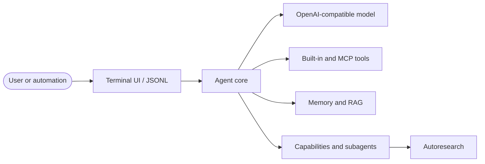

<div align="center">

<picture>
  <source media="(prefers-color-scheme: dark)" srcset="logo/logician-banner.svg">
  
</picture>

### A local-first coding agent built for the terminal

Streaming, extensible, SSH-ready, and designed to turn instructions into verified code changes.

[](https://nodejs.org)
[](https://bun.sh)
[](https://typescriptlang.org)


[Install](#install) · [Quick start](#quick-start) · [Features](#why-logician) · [Documentation](docs/index.md) · [Architecture](#architecture)

</div>

---

Logician is an agentic coding environment for OpenAI-compatible model backends. It combines a responsive terminal interface with code-aware tools, persistent sessions, memory, RAG, plugins, skills, MCP servers, and observable agent execution.

It works equally well at a local workstation, inside `tmux`, or over SSH—and it also exposes a structured JSONL mode for automation.

## Why Logician

| | Capability | What it gives you |
|---|---|---|
| ⚡ | **Streaming-first TUI** | Live responses, thinking modes, tool cards, overlays, and steering without leaving the terminal |
| 🛠️ | **Code-aware execution** | Precise edits, fast search, shell execution, Git workflows, syntax diagnostics, and verification |
| 🧠 | **Persistent memory** | Workspace-scoped observations and durable lessons with lexical + semantic retrieval |
| 📚 | **Hybrid RAG** | Dense and BM25 retrieval, structural chunking, reranking, source attribution, and context budgeting |
| 🔌 | **Extensibility** | `SKILL.md` capabilities, plugins, lifecycle hooks, custom events, and MCP tools |
| 🌿 | **Parallel agents** | Delegate bounded work to child agents with isolated context and worktree support |
| 🛡️ | **Controlled autonomy** | Permission modes, sandbox profiles, workspace trust, loop guards, and cancellation |
| 💾 | **Durable sessions** | JSONL transcripts, search, bookmarks, branching, rewind, export, and compaction |
| 🧪 | **Autoresearch** | Run measured experiment loops and keep improvements that beat the baseline |
| 🤖 | **Headless operation** | Versioned JSONL events for scripts, CI, editors, and other agent systems |

## Install

### Prebuilt binary

```bash
curl -fsSL https://raw.githubusercontent.com/lseman/logician/main/apps/tui/install.sh | bash
```

The installer supports Linux and macOS on `x86_64` and `arm64`. To install a specific release:

```bash
curl -fsSL https://raw.githubusercontent.com/lseman/logician/main/apps/tui/install.sh | bash -s -- 0.3.0
```

### From source

```bash
git clone https://github.com/lseman/logician.git
cd logician
bun install
bun start
```

### Requirements

| Requirement | Details |
|---|---|
| Runtime | Bun `>=1.3.14` or Node.js `>=22.19.0` |
| Model | An OpenAI-compatible API endpoint |
| Search | `rg` and `fd` are optional but recommended |
| Web search | An optional SearXNG instance |
| Integrations | Optional stdio or streamable HTTP MCP servers |

## Quick start

Logician defaults to an OpenAI-compatible endpoint at `http://127.0.0.1:8080`. Create `.logician.json` in your project when you need to override it:

```json
{
  "baseUrl": "http://127.0.0.1:8080",
  "model": "your-model",
  "permissionMode": "acceptEdits",
  "executionProfile": "autonomous",
  "memory": true,
  "memoryEmbeddings": true
}
```

Then start Logician from the repository you want to work on:

```bash
logician
```

Give it an outcome, not a sequence of keystrokes:

```text
Fix the failing authentication tests, preserve the public interface, and verify the result.
```

Inside the composer:

```text
/ Enter commands  ·  Ctrl+Enter steer now  ·  Ctrl+O tools
```

## Everyday workflows

### Interactive coding

Ask Logician to inspect, implement, test, and explain changes in one continuous session. Tool calls remain visible and interruptible, and you can steer the active turn with `Ctrl+Enter`.

### Headless automation

```bash
bun start -- exec --jsonl "fix the failing test"
```

Standard output contains versioned content, tool, error, terminal-metadata, and completion records. Diagnostics are written to standard error so the JSONL stream remains machine-readable.

### Environment diagnostics

```bash
bun start -- doctor
bun start -- doctor --json
```

`doctor` checks configuration, local dependencies, MCP declarations, skills, permissions, and sandbox readiness without contacting the model or starting MCP servers.

### Extend the agent

- Add focused instructions and workflows with [`SKILL.md`](docs/guides/skills.md) files.
- Package skills, hooks, commands, and integrations as [plugins](docs/guides/plugins.md).
- Connect external tools through [MCP](docs/guides/mcp.md).
- Use Pi-compatible extension events and lifecycle hooks to customize runtime behavior.

## Keyboard shortcuts

| Shortcut | Action |
|---|---|
| `Ctrl+L` | Open the model selector |
| `Ctrl+G` | Jump to a file in the current working set |
| `Ctrl+O` | Expand or collapse tool execution details |
| `Alt+J` / `Alt+K` | Move between tool cards |
| `Alt+Enter` | Toggle the focused tool card |
| `Ctrl+Shift+T` | Cycle thinking display mode |
| `Ctrl+S` | Open the session manager |
| `Ctrl+K` | Cycle sandbox mode |
| `Ctrl+P` | Toggle plan and act modes |
| `Ctrl+Enter` | Send immediate steering or flush queued steering |
| `Ctrl+M` / `Alt+M` | Open the inference-mode selector |
| `Ctrl+I` | Toggle autonomous and minimal execution |
| `Ctrl+A` | Open the autoresearch dashboard |

Type `/help` for the live command list. Common entry points include `/sessions`, `/context`, `/compact`, `/agents`, `/plugins`, `/mcp`, `/permissions`, `/settings`, and `/rag`.

## Architecture

Logician is a TypeScript monorepo organized as a layered agent runtime:



| Package | Responsibility |
|---|---|
| `@logician/tui` | Terminal rendering, input, overlays, transcript display, and headless execution |
| `@logician/agent-core` | Provider loop, harness, event lifecycle, hooks, queues, guards, compaction, tools, config, sessions, commands, skills, MCP, trust, and orchestration |
| `@logician/agent-capabilities` | Delegation, reasoning strategies, tasks, user interaction, and agent primitives |
| `@logician/memory` | SQLite-backed observations, semantic episodes, consolidation, and task-aware recall |
| `@logician/memory-mcp` | Five-tool stdio MCP adapter for sharing workspace memory with other agents |
| `@logician/rag` | Document ingestion, chunking, hybrid retrieval, reranking, and context assembly |
| `@logician/autoresearch` | Bounded experiment loops with measurement and keep-or-discard decisions |
| `@logician/agent-eval` | Versioned coding-task corpora, independent graders, trials, and quality reports |

The core flow is deliberately simple:

```text
input → provider → streamed events → tool calls → results → next turn → settled
```

Hooks, plugins, memory, guardrails, and UI projections observe or transform that lifecycle through explicit event seams rather than owning separate agent loops.

Read the [architecture overview](docs/architecture/overview.md), [agent loop](docs/architecture/agent-loop.md), [hook system](docs/architecture/hooks.md), and [session model](docs/architecture/sessions.md) for the deeper design.

## Safety and control

Logician separates execution policy from permissions:

- **Execution profile** decides whether the built-in agent policy actively continues unfinished work (`autonomous`) or yields control to its caller (`minimal`).
- **Permission mode** decides which operations require confirmation (`acceptAll`, `acceptEdits`, `ask`, or `plan`).
- **Sandbox mode** controls process isolation independently of both.
- **Workspace trust** gates project-provided skills, plugins, and other executable configuration.

This separation lets you use an autonomous agent with strict permissions or embed a minimal loop with broader tool access.

## Development

Reusable TypeScript modules live under `packages/`; executable front ends live
under `apps/`. The terminal application is in `apps/tui` and consumes the same
agent and memory modules available to other hosts.

```bash
bun install
bun run dev         # launch from source
bun run typecheck   # check all workspaces
bun run lint        # run Biome
bun run test        # run the main test suites
bun run ci          # typecheck + lint + formatting + tests
```

Documentation lives in [`docs/`](docs/index.md). Run its local site with:

```bash
cd docs
npm install
npm run dev
```

## Documentation

- [Getting started](docs/getting-started.md)
- [Configuration](docs/guides/configuration.md)
- [Terminal UI](docs/guides/terminal-ui.md)
- [Sessions and compaction](docs/guides/sessions.md)
- [Skills](docs/guides/skills.md)
- [Plugins](docs/guides/plugins.md)
- [MCP](docs/guides/mcp.md)
- [Subagents](docs/guides/subagents.md)
- [Troubleshooting](docs/guides/troubleshooting.md)

## License

MIT
