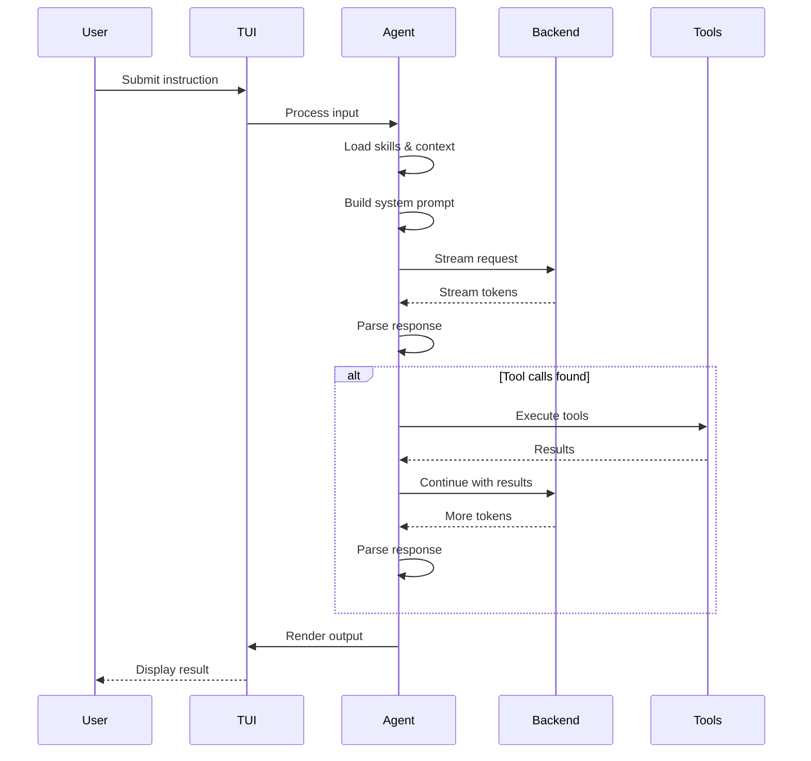

# Agent Loop

The agent loop is the core execution cycle that drives all agent behavior.

## Session composition

Applications use `AgentSession` from `@logician/log-core/session`. It owns the interactive lifecycle and invokes the lower-level functional harness for each prepared turn. The harness has no session state or reverse dependency. Applications can assemble reusable capability bundles with `defineHarnessModule()` instead of wrapping or subclassing the session:

```ts
import { AgentSession, defineHarnessModule } from "@logician/log-core/session";

const diagnostics = defineHarnessModule({
  name: "diagnostics",
  config: {
    tools: [diagnosticsTool],
    maxRetries: 2,
  },
  observers: [{ event: event => telemetry.record(event) }],
});

const session = new AgentSession({
  backend,
  config: { baseUrl, model },
  modules: [diagnostics],
});
```

Modules are inert: construction composes their configuration, tools, and observers before any run begins. Direct session configuration wins over module defaults. Tool and module names must be unique, so ambiguous installations fail immediately with `HarnessConfigurationError`.

Runtime configuration goes through `session.configure(patch)`. Tool patches rebuild the live registry and emit the same durable/session notifications as other tool changes. Observation uses one multi-listener seam:

```ts
const unsubscribe = session.observe({
  phaseChange: (phase, previous) => {},
  queueChange: queues => {},
  settled: nextTurnCount => {},
  event: event => {},
});
```

## Loop diagram



## Loop stages

| Stage | Description | Hook points |
|---|---|---|
| 1. Input | Receive user instruction | — |
| 2. Context | Load skills, tools, context files | `beforeAgentStart`, `transformContext` |
| 3. Prompt | Build system prompt with tools | `beforeProviderRequest`, `beforeProviderPayload` |
| 4. Request | Call LLM with streaming | — |
| 5. Parse | Extract tool calls from response | `afterProviderResponse` |
| 6. Execute | Run tool calls | `beforeToolCall`, `afterToolCall` |
| 7. Repeat | Feed results back to LLM | `prepareNextTurn`, `shouldStopAfterTurn` |
| 8. Output | Render final response | — |

## Adaptive context planning

At each user-initiated turn, `AgentSession` asks the adaptive context controller
to build one request-scoped plan. The controller deduplicates context already in
the conversation, ranks contributions using declared priority, lexical relevance
to the current objective, learned source utility, and a bounded exploration
bonus, then packs individual messages under an injection budget. Automatically
activated skills, plugin hooks, extensions, and application context cross this
same seam as separately attributed sources. Queued next-turn user guidance is
control-plane input and remains outside the adaptive budget.

The controller records whether the resulting run passed acceptance checks (or,
when no acceptance report exists, completed successfully). That outcome updates
an in-memory utility estimate for the included sources, influencing later turns
without making context selection nondeterministic. The plan and its feedback are
request-scoped; injected messages never become durable conversation history.

The public module interface is intentionally small:

```ts
const plan = controller.buildContext(request);
controller.recordOutcome(plan.id, { success: true });
```

Persistence is not part of this interface. It should be introduced only when a
host needs a durable adapter in addition to the current in-memory behavior.

## Error handling

The backend classifies errors into categories:

| Category | Retryable | Action |
|---|---|---|
| `context_full` | No | Compact session |
| `rate_limit` | Yes | Backoff retry |
| `transient` | Yes | Backoff retry |
| `client` | No | Report to user |
| `poisoned_history` | No | Compaction |
| `unknown` | No | Report to user |

## Iteration limits

```json
{
  "maxIterations": 10,
  "maxTokens": 8192
}
```

The loop terminates when:
- The agent produces a final response (no tool calls)
- `maxIterations` is reached
- `maxTokens` is exceeded
- The user cancels
