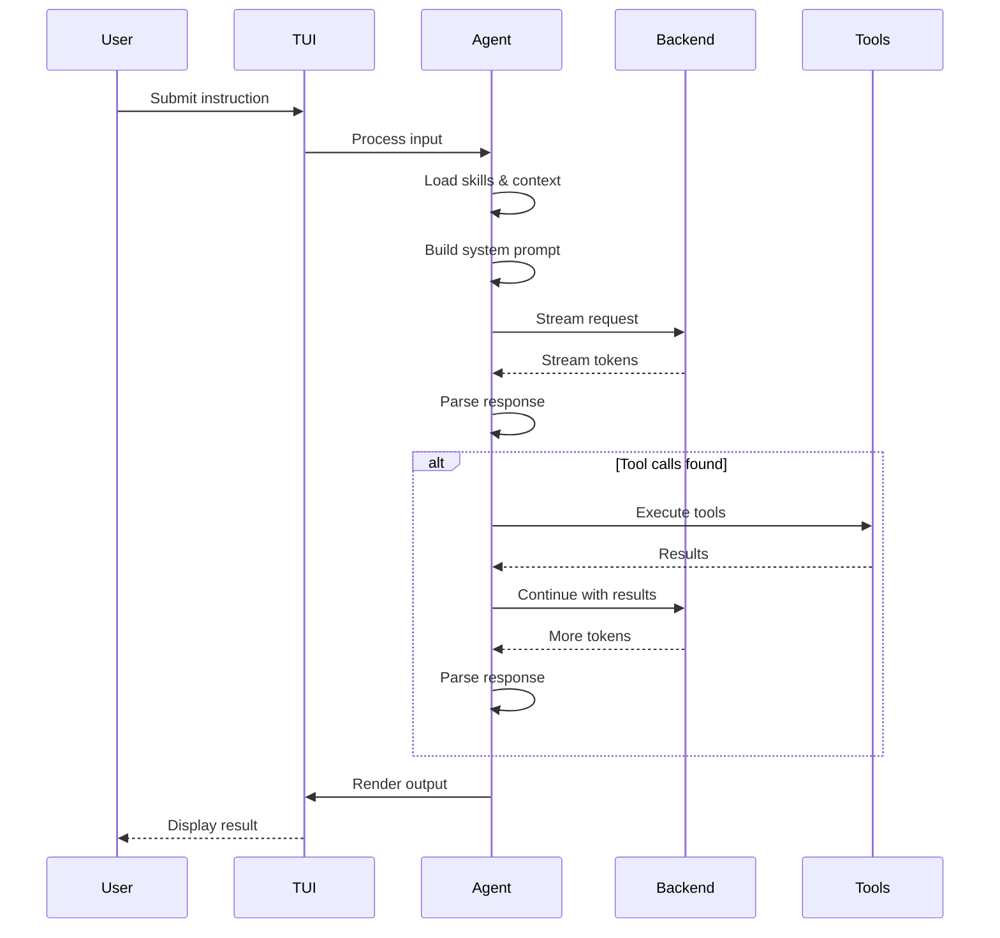

# Agent Loop

The agent loop is the core execution cycle that drives all agent behavior.

## Harness composition

`AgentHarness` is available from `@logician/log-core/harness`. Applications can assemble reusable capability bundles with `defineHarnessModule()` instead of wrapping or subclassing the harness:

```ts
import { AgentHarness, defineHarnessModule } from "@logician/log-core/harness";

const diagnostics = defineHarnessModule({
  name: "diagnostics",
  config: {
    tools: [diagnosticsTool],
    maxRetries: 2,
  },
  observers: [{ event: event => telemetry.record(event) }],
});

const harness = new AgentHarness({
  backend,
  config: { baseUrl, model },
  modules: [diagnostics],
});
```

Modules are inert: construction composes their configuration, tools, and observers before any run begins. Direct harness configuration wins over module defaults. Tool and module names must be unique, so ambiguous installations fail immediately with `HarnessConfigurationError`.

Runtime configuration goes through `harness.configure(patch)`. Tool patches rebuild the live registry and emit the same durable/session notifications as other tool changes. Observation uses one multi-listener seam:

```ts
const unsubscribe = harness.observe({
  phaseChange: (phase, previous) => {},
  queueChange: queues => {},
  settled: nextTurnCount => {},
  event: event => {},
});
```

## Loop diagram



## Loop stages

| Stage | Description | Hook points |
|---|---|---|
| 1. Input | Receive user instruction | — |
| 2. Context | Load skills, tools, context files | `beforeAgentStart`, `transformContext` |
| 3. Prompt | Build system prompt with tools | `beforeProviderRequest`, `beforeProviderPayload` |
| 4. Request | Call LLM with streaming | — |
| 5. Parse | Extract tool calls from response | `afterProviderResponse` |
| 6. Execute | Run tool calls | `beforeToolCall`, `afterToolCall` |
| 7. Repeat | Feed results back to LLM | `prepareNextTurn`, `shouldStopAfterTurn` |
| 8. Output | Render final response | — |

## Error handling

The backend classifies errors into categories:

| Category | Retryable | Action |
|---|---|---|
| `context_full` | No | Compact session |
| `rate_limit` | Yes | Backoff retry |
| `transient` | Yes | Backoff retry |
| `client` | No | Report to user |
| `poisoned_history` | No | Compaction |
| `unknown` | No | Report to user |

## Iteration limits

```json
{
  "maxIterations": 10,
  "maxTokens": 8192
}
```

The loop terminates when:
- The agent produces a final response (no tool calls)
- `maxIterations` is reached
- `maxTokens` is exceeded
- The user cancels
