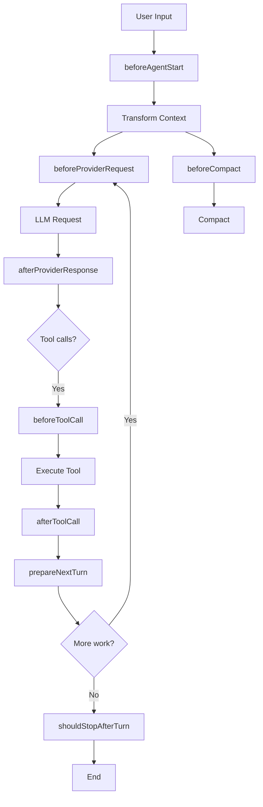

# Hook System

The hook system provides lifecycle callbacks at key points in the agent loop. Hooks are registered on the `HookBus` and can observe, modify, or short-circuit agent behavior.

## Hook lifecycle



## Available hooks

### beforeAgentStart

```typescript
interface BeforeAgentStartContext {
  prompt: string
  systemPrompt: string
  messages: AgentMessage[]
}

interface BeforeAgentStartResult {
  messages?: AgentMessage[]
  systemPrompt?: string
}
```

Fired before the agent starts processing. Use to:
- Modify the system prompt dynamically
- Prepend or append messages
- Inject context from external sources

### beforeToolCall

```typescript
interface BeforeToolCallContext {
  toolCall: ToolCall
  args: Record<string, unknown>
  iteration: number
}

interface BeforeToolCallResult {
  content?: string          // Short-circuit with content
  isError?: boolean         // Treat as error
  args?: Record<string, unknown>  // Rewrite arguments
}
```

Fired before a tool executes. Use to:
- Log tool invocations
- Validate or rewrite arguments
- Short-circuit execution (return `{ content }` or `{ isError }`)

### afterToolCall

```typescript
interface AfterToolCallContext {
  toolCall: ToolCall
  args: Record<string, unknown>
  result: string
  isError: boolean
  iteration: number
}

interface AfterToolCallResult {
  content?: string    // Override result
  isError?: boolean   // Mark as error
  terminate?: boolean // Stop the loop
}
```

Fired after tool completion. Use to:
- Log results
- Handle or transform errors
- Terminate the loop on specific conditions

### prepareNextTurn

```typescript
interface PrepareNextTurnContext {
  messages: Message[]
  iteration: number
  hadToolCalls: boolean
}

interface PrepareNextTurnResult {
  messages: Message[]  // Return modified messages
}
```

Fired before preparing the next turn. Use to:
- Transform messages before sending to the provider
- Inject context or instructions
- Remove or modify conversation history

### transformContext

```typescript
interface TransformContext {
  messages: AgentMessage[]
  iteration: number
  signal?: AbortSignal
}

interface TransformContextResult {
  messages: AgentMessage[]
}
```

Fired during context assembly. Use to:
- Modify messages based on conversation context
- Abort transformation via signal
- Apply task-aware context shaping

### beforeProviderRequest

```typescript
interface BeforeProviderRequestContext {
  model: string
  sessionId: string
  iteration: number
  streamOptions: AgentHarnessStreamOptions
}

interface BeforeProviderRequestResult {
  headers?: Record<string, string | undefined>  // Header patch
  timeoutMs?: number                            // Timeout override
  maxRetries?: number                           // Retry override
  cacheRetention?: string                       // Cache hint
  metadata?: Record<string, unknown>            // Additional headers
  transport?: string                            // Provider metadata
}
```

Fired before sending a request to the LLM provider. Use to:
- Add custom headers
- Override timeout or retry settings
- Inject provider metadata

### beforeProviderPayload

```typescript
interface BeforeProviderPayloadContext {
  model: string
  payload: Record<string, unknown>
}

interface BeforeProviderPayloadResult {
  payload: Record<string, unknown>
}
```

Fired before sending the request payload. Use to:
- Modify the payload structure
- Add or remove fields
- Inject provider-specific options

### afterProviderResponse

```typescript
interface AfterProviderResponseContext {
  model: string
  content: string
  toolCallCount: number
  stopReason: StopReason
  usageTokens?: number
  iteration: number
}
```

Fired after receiving a response from the LLM provider. Use to:
- Log responses
- Track token usage
- Trigger alerts on specific patterns

### shouldStopAfterTurn

```typescript
interface ShouldStopAfterTurnContext {
  messages: Message[]
  iteration: number
  hadToolCalls: boolean
}
```

Fired after each turn. Use to:
- Implement custom termination conditions
- Stop the loop based on message content

### getSteeringMessages

```typescript
interface GetSteeringMessagesContext {
  messages: Message[]
  iteration: number
}
```

Fired when building steering messages. Use to:
- Inject steering context
- Modify steering behavior

### getFollowUpMessages

```typescript
interface GetFollowUpMessagesContext {
  messages: Message[]
  iteration: number
  assistantText: string
  stopReason?: StopReason
}
```

Fired when building follow-up messages. Use to:
- Inject follow-up context
- Modify follow-up behavior

### beforeCompact

```typescript
interface BeforeCompactContext {
  messages: Message[]
  tokensBefore: number
  reason: "manual" | "auto"
}

interface BeforeCompactResult {
  cancel?: boolean     // Skip compaction
  summary?: string     // Pre-built summary
}
```

Fired before compaction. Use to:
- Skip compaction entirely
- Provide a pre-built summary

## Writing a hook

```typescript
// plugins/logging.ts
export default {
  name: 'logging',
  hooks: {
    beforeToolCall({ toolCall, args, iteration }) {
      console.log(`[log] ${toolCall.name}(${JSON.stringify(args)})`)
    },
    afterToolCall({ toolCall, result, isError }) {
      if (isError) {
        console.error(`[log] ${toolCall.name} failed: ${result}`)
      }
    },
  },
}
```

## Hook execution order

Hooks execute in registration order within each event type. Each hook can return a result that modifies behavior (e.g., short-circuiting tool execution, overriding results).
