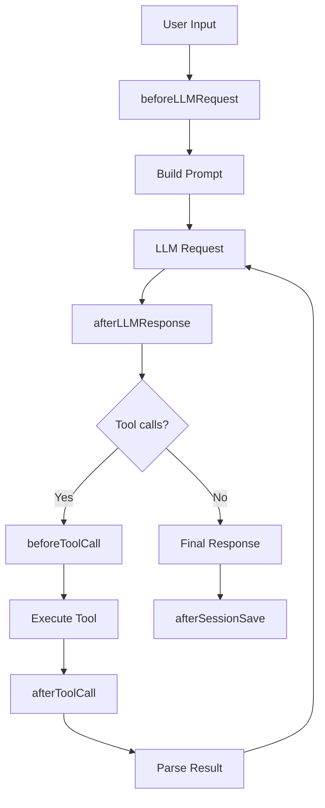

# Hook System

The hook system provides lifecycle callbacks at key points in the agent loop. Plugins register hooks to observe or modify behavior.

## Hook types



## Hook signatures

### beforeLLMRequest

```typescript
type BeforeLLMRequestHook = (ctx: {
  messages: Message[]
  tools: Tool[]
  config: Config
}) => void | Promise<void>
```

Fired before the LLM is called. Use to:
- Log requests
- Modify messages
- Add system prompts dynamically

### afterLLMResponse

```typescript
type AfterLLMResponseHook = (ctx: {
  response: LLMResponse
  toolCalls: ToolCall[]
}) => void | Promise<void>
```

Fired after the LLM returns. Use to:
- Log responses
- Parse and validate tool calls
- Trigger alerts on specific patterns

### beforeToolCall

```typescript
type BeforeToolCallHook = (ctx: {
  toolName: string
  args: Record<string, unknown>
}) => void | Promise<void>
```

Fired before a tool executes. Use to:
- Log tool invocations
- Validate arguments
- Implement custom access control

### afterToolCall

```typescript
type AfterToolCallHook = (ctx: {
  toolName: string
  result: unknown
  error?: Error
}) => void | Promise<void>
```

Fired after tool completion. Use to:
- Log results
- Handle errors
- Trigger side effects

### beforeSessionSave / afterSessionSave

```typescript
type BeforeSessionSaveHook = (ctx: {
  sessionId: string
  messages: Message[]
}) => void | Promise<void>

type AfterSessionSaveHook = (ctx: {
  sessionId: string
}) => void | Promise<void>
```

Fired around session persistence. Use to:
- Backup sessions
- Sync to remote storage
- Export to external systems

## Writing a hook

```typescript
// plugins/logging.ts
export default {
  name: 'logging',
  hooks: {
    beforeToolCall({ toolName, args }) {
      console.log(`[log] ${toolName}(${JSON.stringify(args)})`)
    },
    afterToolCall({ toolName, result, error }) {
      if (error) {
        console.error(`[log] ${toolName} failed: ${error.message}`)
      }
    },
  },
}
```

## Hook priority

Hooks execute in registration order. No priority system — order matters.
