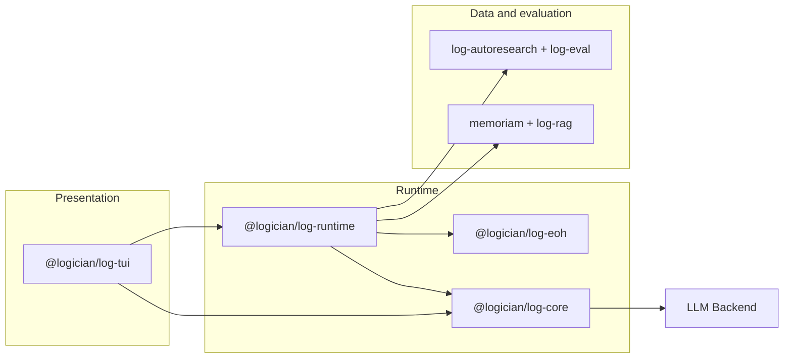
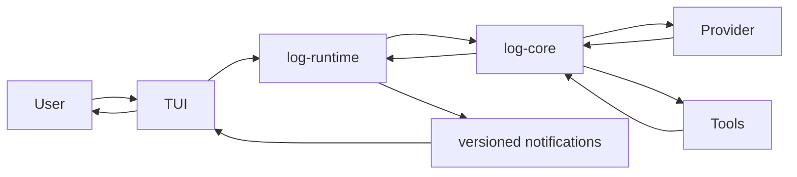

# System Overview

Logician is a TypeScript monorepo whose packages form a layered runtime.

## Package layers



## Package details

### log-core

The foundation layer. Handles:
- LLM backend (OpenAI-compatible HTTP client)
- Agent loop execution
- Provider-facing runtime configuration
- Append-only agent session journal
- Compaction (context window management)
- Hook system
- Tool registry and execution

Inside the package, source is one flat folder per feature module, each
assigned a layer. A module imports (at runtime) only from its own layer or
below; `src/__tests__/architecture-boundaries.test.ts` enforces this, and
every new top-level folder must declare its layer there.

```text
0  types/ lifecycle/ events/         vocabulary, cancellation, event journal + runtime state
1  tools/ config/ evaluation/        tool registry/permissions, settings + model caps, trajectories
2  provider/                         LLM backend, adapters, message helpers, tokenizer
3  session/ guards/ ttsr/ policy/    journal + checkpoints, loop/output guards, stream rules,
   context/                          run policy and budgets, adaptive context
4  compaction/                       context-window compaction
5  loop/ hooks/ extensions/          the agent loop + tool batches, hook bus, extension runner
6  harness/                          AgentSession: the stateful owner of a running agent
```

`types/` holds pure vocabulary (`TaskLedger`, `RunBudgetLimits`,
`AcceptanceConfig`, and similar) with no behavior, so every layer can share
one definition without a circular dependency. Product composition — wiring
log-core into a running agent — lives in `log-runtime`, not inside log-core
itself. The harness uses immutable configuration revisions, an append-only
thread ledger, a run-scoped policy controller, and an adaptive context
controller that plans request-scoped contributions under a token budget and
learns source utility from run outcomes.

Execution durability is split across the thread ledger, file checkpoints,
and run-scoped policy state — see
[Durability & Recovery](/architecture/run-kernel).

The evidence and invariants behind the current runtime boundaries are recorded
in [Runtime Design Decisions](/architecture/modernization).

### Client protocol

The dependency-free, versioned client protocol lives inside `log-core` and is
exported as `@logician/log-core/protocol`; its event vocabulary is exported as
`@logician/log-core/events`. `log-runtime` translates internal agent events into
ordered protocol notifications before they cross the application boundary.
The TUI and headless clients subscribe through `AgentRuntime.events` rather
than depending on runtime internals.

### log-runtime

Composes log-core into a running agent and hosts every optional product
capability, organized as one folder per capability under `capabilities/`:
- `reasoning/` — ToT, SSR, Reflexion, Best-of-N, Self-Consistency, Auto-CoT,
  In-Context CoT, GoT, plus a shared base and registry
- `delegation/` — subagent spawning and definitions
- `tasks/` — todo/task tracking
- `ask/` — structured mid-turn prompts back to the user
- `rag/` — retrieval-backed tools (backed by `@logician/log-rag`)
- `tools/` — the built-in tool registry, including `builtin-blocks.ts`,
  which assembles tools from the capabilities above
- `memory/`, `lsp/`, `mcp/`, `skills/`, `interactions/`, `extensions/`,
  `repository-map/`, `prompts/`, `commands/` — the remaining capability seams

`runtime/` is the orchestration layer on top. `AgentRuntime` remains the stable
client-facing facade, while application modules behind it own distinct state
transitions:

```text
AgentRuntime (compatibility facade)
├── TurnOrchestrator + SessionRunner       turn admission and execution
├── ConversationSession                   harness, history, queues, branches
├── ConversationIdentity                  session/event/hook/memory identity
├── CommandDispatcher                     slash, skill, and prompt routing
├── PluginLifecycle                       startup, resources, hooks, shutdown
├── RuntimeConfiguration + RuntimeActivity settings and observable run state
└── ToolRouter + capability gateways      product capability adapters
```

These seams keep orchestration policy out of the presentation layer and avoid
making the facade the owner of every subsystem. Tests exercise each module
through the same interface used by `AgentRuntime`.

### log-eoh

Evolution of Heuristics ([arXiv:2401.02051](https://arxiv.org/abs/2401.02051)):
an evolutionary optimization engine with its own session logic, population
management, compaction, and dashboard. It's a standalone workspace package
that `log-runtime` wires in directly as one more capability. Not on the
runtime's critical path; opt-in.

### tui

The presentation layer. Handles:
- Terminal UI rendering
- Input handling
- Streaming output
- State management
- Layout and theming

### memoriam and log-rag

Workspace-scoped durable memory and document/repository retrieval, with hybrid
ranking, provenance, context budgets, and component evaluation. `memoriam` is a
standalone Python engine (`ecosystem/memoriam`) that the runtime embeds as an
out-of-process JSON-lines SDK worker, mirroring the `legroom` integration.
Memory claims use gated lifecycles, executable validity predicates, and
outcome-linked shadow learning; see [Evolving memory](./evolving-memory.md).

### log-autoresearch and log-eval

Measured experiment loops and independently graded coding-task trials. Agent
evaluation treats repository state and executable checks as authoritative; an
agent's own completion claim is retained only as diagnostic evidence.

## Data flow



### Worker and capability ownership

`AgentRuntime.memory` and `AgentRuntime.compression` expose capability operations.
Callers use these instead of top-level memory/compression forwarding methods or
raw worker accessors. Their interfaces omit lifecycle and enablement controls.
Configuration changes go through `updateSettings`; runtime shutdown closes the
capability gateways.

Each gateway owns its enabled state and its private worker. Workers translate
domain operations and responses. The shared internal `JsonlWorker` owns process
startup, ordered initialization, request IDs, timers, pending requests, and
shutdown. Responses, timeouts, write failures, and process termination settle
requests through one removal operation. Pending requests belong to a process
generation, so a late event from an old process cannot affect its replacement.
