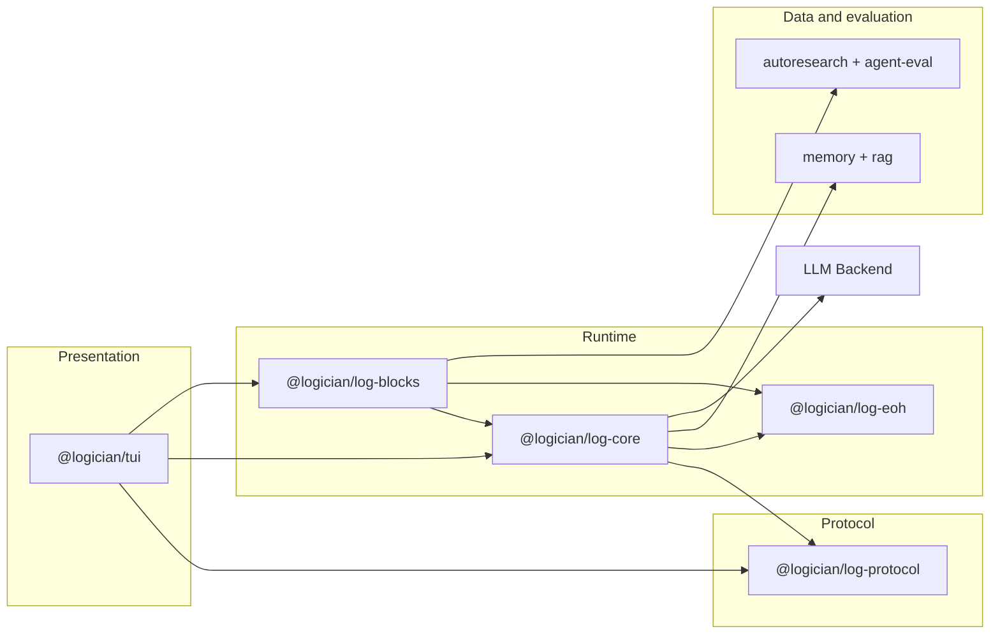
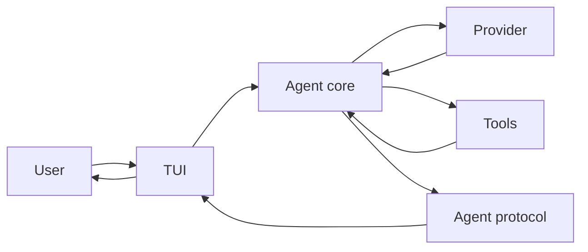

# System Overview

Logician is a TypeScript monorepo whose packages form a layered runtime.

## Package layers



## Package details

### agent-core

The foundation layer. Handles:
- LLM backend (OpenAI-compatible HTTP client)
- Agent loop execution
- Provider-facing runtime configuration
- Append-only agent session journal
- Compaction (context window management)
- Hook system
- Tool registry and execution

Inside the package, dependency direction is strict:

```text
protocol <- core
core <- capabilities
core <- infrastructure
core + infrastructure <- adapters
core + capabilities + infrastructure + adapters <- application
```

`core/` cannot import product feature packages. Product composition lives at
the application edge. The harness uses immutable configuration revisions, an
append-only thread ledger, a run-scoped policy controller, and a context engine.

Execution durability is split across the thread ledger, file checkpoints,
and run-scoped policy state — see
[Durability & Recovery](/architecture/run-kernel).

The evidence and invariants behind the current runtime boundaries are recorded
in [Runtime Design Decisions](/architecture/modernization).

### agent-protocol

The dependency-free client protocol. It owns versioned UI-ready notifications.
Internal provider, hook, and tool events are translated before crossing this
seam. TUI and future clients depend on this package rather than core internals.

### agent-blocks

Optional product feature modules:
- Reasoners (ToT, SSR, Reflexion, etc.)
- Subagent delegation
- Todo/task management
- Tool selection and execution strategies
- Re-exports `@logician/log-eoh` (below) as an opt-in reasoning strategy

### eoh

Evolution of Heuristics ([arXiv:2401.02051](https://arxiv.org/abs/2401.02051)):
an evolutionary optimization engine with its own session logic, population
management, compaction, and dashboard. It's a standalone workspace package —
`agent-core`'s application layer wires it in directly, and `agent-blocks`
re-exports it as one more reasoning strategy. Not on the runtime's critical
path; opt-in.

### tui

The presentation layer. Handles:
- Terminal UI rendering
- Input handling
- Streaming output
- State management
- Layout and theming

### memory and rag

Workspace-scoped durable memory and document/repository retrieval, with hybrid
ranking, provenance, context budgets, and component evaluation.
Memory claims also use gated lifecycles, executable validity predicates, and
outcome-linked shadow learning; see [Evolving memory](./evolving-memory.md).

### autoresearch and agent-eval

Measured experiment loops and independently graded coding-task trials. Agent
evaluation treats repository state and executable checks as authoritative; an
agent's own completion claim is retained only as diagnostic evidence.

## Data flow


