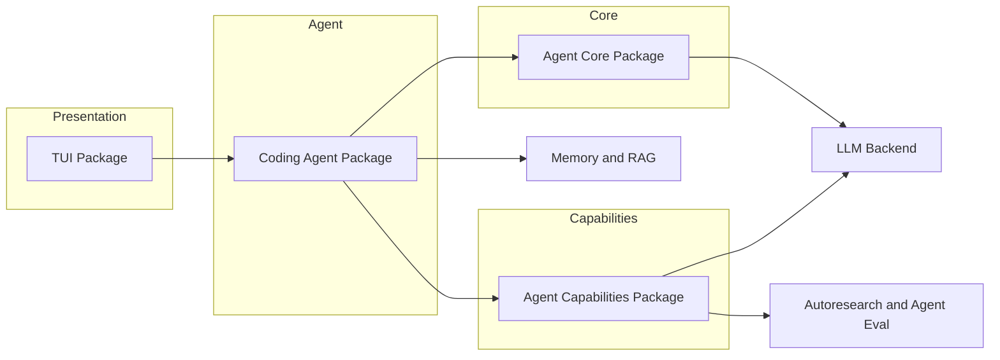

# System Overview

Logician is built as seven focused packages that form a layered architecture.

## Package layers



## Package details

### agent-core

The foundation layer. Handles:
- LLM backend (OpenAI-compatible HTTP client)
- Agent loop execution
- Configuration management
- Session persistence (SQLite)
- Compaction (context window management)
- Hook system
- Tool registry and execution

Execution durability is owned by the [Run Kernel](/architecture/run-kernel), a
versioned event ledger used for replay, task-spanning budgets, fencing, and tool
effect recovery.

The evidence and invariants behind the current runtime boundaries are recorded
in [Runtime Design Decisions](/architecture/modernization).

### coding-agent

The orchestration layer. Handles:
- System prompt construction
- Skills loading and activation
- Session management (bookmarks, branching)
- Trust model (permission modes)
- MCP server integration
- Prompt guidelines and context files

### agent-capabilities

The intelligence layer. Handles:
- Reasoners (ToT, SSR, Reflexion, etc.)
- Subagent delegation
- Todo/task management
- EOH (Evolution of Hints) engine
- Tool selection and execution strategies

### tui

The presentation layer. Handles:
- Terminal UI rendering
- Input handling
- Streaming output
- State management
- Layout and theming

### memory and rag

Workspace-scoped durable memory and document/repository retrieval, with hybrid
ranking, provenance, context budgets, and component evaluation.

### autoresearch and agent-eval

Measured experiment loops and independently graded coding-task trials. Agent
evaluation treats repository state and executable checks as authoritative; an
agent's own completion claim is retained only as diagnostic evidence.

## Data flow

```
User Input → TUI → Coding Agent → Agent Core → LLM Backend
                                                                ↓
User Display ← TUI ← Coding Agent ← Agent Core ← LLM Response ←
```
