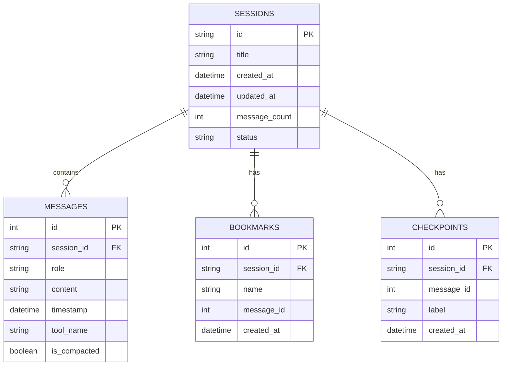
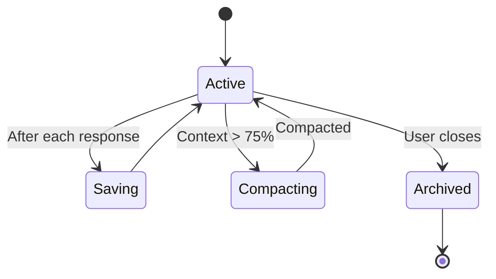

# Session Persistence

Logician stores all session data in SQLite, providing fast queries and reliable recovery.

## Database schema



## Recovery

Sessions survive crashes and restarts:

1. **Auto-save** — messages are saved after each LLM response
2. **Checkpoint** — manual save points for rewind
3. **Bookmark** — named save points with labels
4. **Compaction** — automatic when context nears limit

## Compaction

When the context window approaches its limit:

```json
{
  "compaction": {
    "enabled": true,
    "triggerFraction": 0.75,
    "strategy": "summarize",
    "keepToolResults": true,
    "keepFinalAnswers": true
  }
}
```

Compaction preserves:
- Tool results and their outcomes
- Final answers to user questions
- Critical decisions and conclusions
- Error messages and their context

## Session lifecycle


