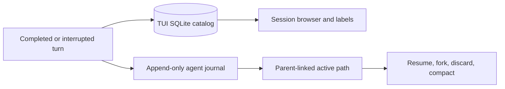
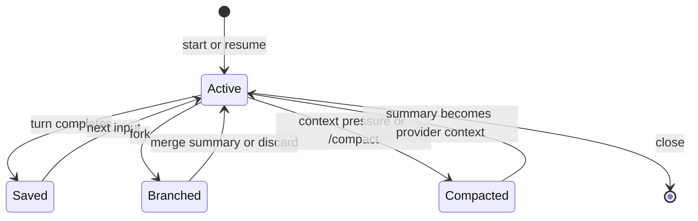

# Session Persistence

Session persistence has two layers because browsing history and recovering an in-flight agent have different requirements.

## TUI catalog

Each workspace stores `history.db` under `.logician/tui/sessions/`. The schema tracks sessions, completed turns, labels, and settings changes. SQLite WAL mode makes incremental saves crash-resistant and supports fast session-browser queries.

## Agent journal

The core session journal is append-only. Entries can point to parents, allowing an active path to diverge without truncating or copying earlier history. Branch operations change the selected leaf or append summaries; they do not rewrite the journal.

## Lifecycle

## Compaction and durability

Compaction changes the context sent to the model, not the historical record shown to the user. Summaries, usage metadata, and the active journal path are persisted so later recovery uses the same logical conversation state.

## File recovery

Conversation branches are distinct from file checkpoints. When checkpointing is enabled, Logician records recoverable file state around edits so rewind can restore both conversational position and affected files without destructive Git operations.
