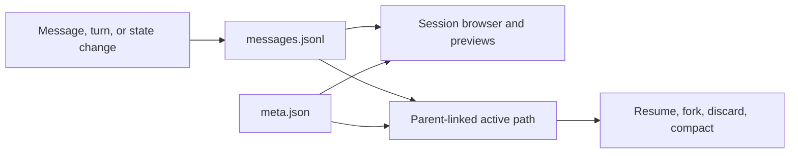
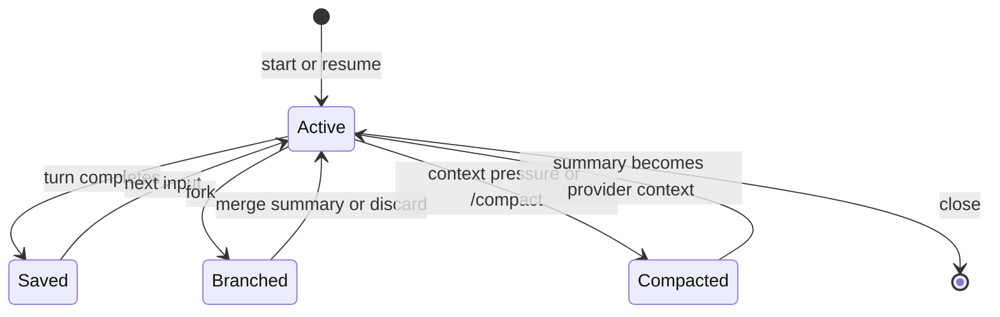

# Session Persistence

Session persistence has one canonical record shared by the TUI and agent
harness. Each session is an append-only JSONL conversation tree accompanied by
a small metadata file.

## On-disk layout

Sessions are stored under `.logician/sessions/sessions/<session-id>/`. `messages.jsonl`
is the append-only entry stream. `meta.json` stores inexpensive listing data:
the session name, workspace, timestamps, entry count, parent session, active
leaf, and format version.

The TUI does not keep a second SQLite history database. Its session service is
an adapter over the same core session registry and journal used by the harness.

## Conversation tree

The core session journal is append-only. Entries can point to parents, allowing an active path to diverge without truncating or copying earlier history. Branch operations change the selected leaf or append summaries; they do not rewrite the journal.

## Lifecycle

## Compaction and durability

Compaction changes the context sent to the model, not the historical record shown to the user. Summaries, usage metadata, and the active journal path are persisted so later recovery uses the same logical conversation state.

JSONL is the source of truth because it is portable, inspectable, and naturally
append-oriented. If Logician adds a SQLite session index, it should remain a
rebuildable query accelerator for search and large catalogs rather than become a
second authoritative history.

Each append is flushed to stable storage before `meta.json` advances. Metadata
and journal rewrites use an fsynced temporary file followed by an atomic rename.
At startup, Logician reconciles stale metadata from the journal, rebuilds missing
or invalid metadata during registry scans, and removes only an incomplete final
JSONL record. Invalid entries earlier in the journal raise a typed corruption
error instead of silently discarding history.

## File recovery

Conversation branches are distinct from file checkpoints. When checkpointing is enabled, Logician records recoverable file state around edits so rewind can restore both conversational position and affected files without destructive Git operations. See [Durability & Recovery](./run-kernel.md) for how checkpoint frames are captured.

Session directories are marked to be skipped by OS-level cloud sync (Time Machine/iCloud on macOS) on a best-effort basis — this is an exclusion hint, not a persistence mechanism, and failures are silent.
