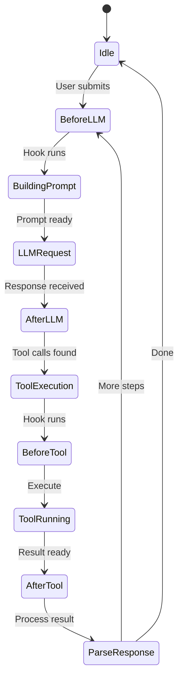

# Plugins & Hooks

Logician uses a hook-based plugin system inspired by Claude Code's lifecycle hooks. Hooks run at key points in the agent loop.

## Hook lifecycle



## Available hooks

| Hook | When it runs | Parameters |
|---|---|---|
| `beforeLLMRequest` | Before calling the LLM | `{ messages, tools, config }` |
| `afterLLMResponse` | After LLM returns | `{ response, toolCalls }` |
| `beforeToolCall` | Before executing a tool | `{ toolName, args }` |
| `afterToolCall` | After tool completes | `{ toolName, result, error }` |
| `beforeSessionSave` | Before persisting session | `{ sessionId, messages }` |
| `afterSessionSave` | After session persisted | `{ sessionId }` |
| `onError` | On any error | `{ error, context }` |

## Writing a plugin

Create a JavaScript/TypeScript module:

```typescript
// my-plugin.ts
export default {
  name: 'my-plugin',
  hooks: {
    beforeToolCall({ toolName, args }) {
      console.log(`[my-plugin] About to call ${toolName}`)
    },
    afterToolCall({ toolName, result, error }) {
      if (error) {
        console.error(`[my-plugin] ${toolName} failed:`, error.message)
      }
    },
  },
}
```

## Configuration

Plugins are loaded from the `plugins/` directory or specified in config:

```json
{
  "plugins": [
    "./plugins/my-plugin.ts",
    "./plugins/analytics.ts"
  ]
}
```
