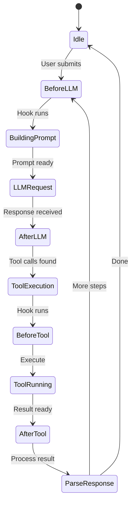

# Plugins & Hooks

Logician uses a hook-based plugin system inspired by Claude Code's lifecycle hooks. Hooks run at key points in the agent loop.

## Hook lifecycle



## Available hooks

| Hook | When it runs | Key parameters |
|---|---|---|
| `beforeAgentStart` | Before agent starts | `{ prompt, systemPrompt, messages }` |
| `transformContext` | During context assembly | `{ messages }` |
| `beforeProviderRequest` | Before LLM request | `{ model, sessionId, streamOptions }` |
| `beforeProviderPayload` | Before request payload | `{ model, payload }` |
| `afterProviderResponse` | After LLM response | `{ model, content, toolCallCount, stopReason }` |
| `beforeToolCall` | Before tool executes | `{ toolCall, args, iteration }` |
| `afterToolCall` | After tool completes | `{ toolCall, result, isError, iteration }` |
| `prepareNextTurn` | Before next turn | `{ messages, iteration, hadToolCalls }` |
| `shouldStopAfterTurn` | After each turn | `{ messages, iteration, hadToolCalls }` |
| `beforeCompact` | Before compaction | `{ messages, tokensBefore, reason }` |
| `getSteeringMessages` | Building steering | `{ messages, iteration }` |
| `getFollowUpMessages` | Building follow-up | `{ messages, iteration, assistantText }` |

## Writing an extension

An extension is a `.ts`/`.js` module with a default export: a function that
receives an `ExtensionAPI` and wires up event subscriptions, tools, or slash
commands:

```typescript
// my-extension.ts
import type { ExtensionAPI } from '@logician/agent-core/extensions'

export default (api: ExtensionAPI) => {
  api.on('tool_execution_start', ({ toolName, args }) => {
    console.log(`[my-extension] About to call ${toolName}`)
  })

  api.on('tool_execution_end', ({ toolName, result, isError }) => {
    if (isError) console.error(`[my-extension] ${toolName} failed:`, result)
  })
}
```

`api.on()` subscribes to the typed extension event vocabulary (see
[API Reference](/reference/api) for the full event list) and returns an
unsubscribe function. Some events — like `tool_execution_start` — let a
handler short-circuit behavior by returning a result (e.g. `{ content }`
skips execution and uses that content instead).

This is a different, narrower surface than the in-process `AgentHooks` /
`HookBus` API described in the [Hook API](/reference/hooks) reference: hooks
compose deterministically and can rewrite arguments, thread transformed
messages, etc.; extension events are primarily for observing lifecycle and
building tools/commands.

## Loading extensions

Extensions are discovered from `.ts`/`.js`/`.mjs` files in these
directories, in order:

- `~/.local/share/logician/extensions/` (or `$XDG_DATA_HOME/logician/extensions/`) — user-level
- `.logician/extensions/` in the project root — project-level

Each file's default export is loaded and invoked once with the shared
`ExtensionAPI`. `.gitignore`/`.ignore` rules inside the extensions directory
are respected when discovering files.
