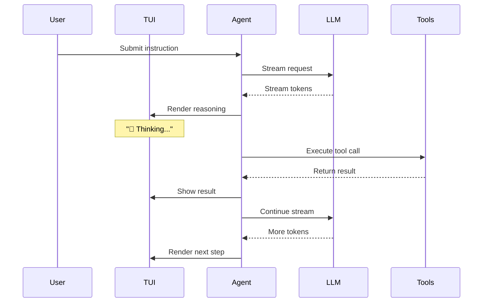

# Streaming Mode

Logician streams everything — reasoning, tool calls, and results — in real time. You see the agent think before it acts.

## How it works



## Stream stages

| Stage | Events | Description |
|---|---|---|
| Turn start | `turn_start`, `message_start` | New turn begins |
| Thinking | `thinking_token` | Agent's internal thought process |
| Response | `token`, `message_update` | Streaming text output |
| Tool execution | `tool_execution_start`, `tool_execution_update`, `tool_execution_end` | Tool invocation with progress |
| Turn end | `turn_end`, `agent_settled` | Turn completes, agent settles |

## Configuration

Streaming is enabled by default. Control it via config:

```json
{
  "streaming": {
    "enabled": true,
    "showThinking": true,
    "showToolCalls": true,
    "showToolResults": true
  }
}
```

## Headless streaming

In headless mode, streaming outputs as JSONL:

```bash
npm start -- exec --jsonl "analyze src/auth.ts"
```

Each line is a typed JSON event:
```json
{"type":"turn_start","turn_id":"turn_1"}
{"type":"thinking_token","token":"Analyzing auth flow..."}
{"type":"tool_execution_start","tool":"read_file","tool_name":"read_file","tool_call_id":"tc_1","tool_args":{"path":"src/auth.ts"}}
{"type":"tool_execution_end","tool":"read_file","tool_name":"read_file","tool_call_id":"tc_1","result":"...","is_error":false}
{"type":"message_update","turnId":"turn_1","message":{"role":"assistant","content":"Found 3 auth middleware functions..."}}
{"type":"turn_end","turn_id":"turn_1","message":""}
```
