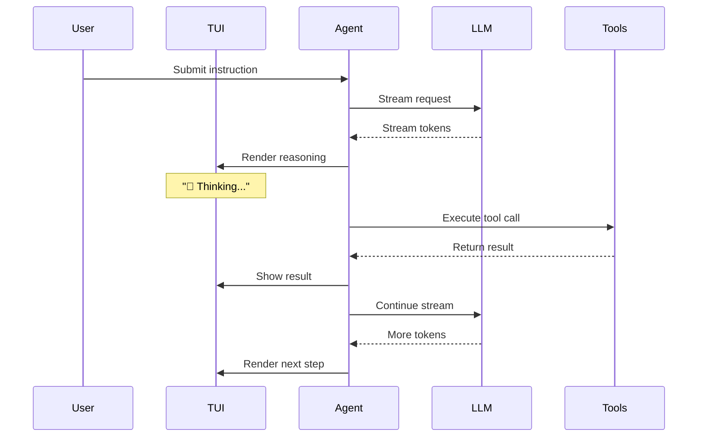

# Streaming Mode

Logician streams everything — reasoning, tool calls, and results — in real time. You see the agent think before it acts.

## How it works



## Stream stages

| Stage | Prefix | Description |
|---|---|---|
| Reasoning | `💭` | Agent's internal thought process |
| Tool call | `🔧` | Tool being invoked with arguments |
| Tool result | `✅` / `❌` | Tool execution result |
| Response | `→` | Final answer to user |

## Configuration

Streaming is enabled by default. Control it via config:

```json
{
  "streaming": {
    "enabled": true,
    "showThinking": true,
    "showToolCalls": true,
    "showToolResults": true
  }
}
```

## Headless streaming

In headless mode, streaming outputs as JSONL:

```bash
npm start -- exec --jsonl "analyze src/auth.ts"
```

Each line is a JSON object:
```json
{"type":"thinking","content":"Analyzing auth flow..."}
{"type":"tool_call","tool":"read_file","args":{"path":"src/auth.ts"}}
{"type":"tool_result","tool":"read_file","success":true,"content":"..."}
{"type":"response","content":"Found 3 auth middleware functions..."}
```
