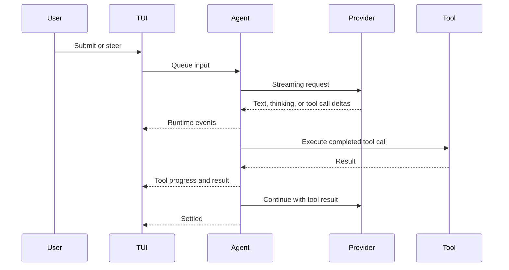

# Streaming

Logician renders provider text and tool progress as events arrive. Thinking output appears only when the selected provider and thinking settings supply it.



## Interactive event families

The bridge exposes turn, message, token, tool-execution, context, queue, permission, retry, compaction, and subagent lifecycle events. The TUI projects those events into transcript text, tool cards, status widgets, and overlays.

Text streaming and thinking display are not an audit log of hidden model reasoning. They are the content the provider exposes through its API.

## Control the display

- `Ctrl+O` expands or collapses tool details.
- `Alt+J`/`Alt+K` moves between tool cards.
- `Alt+Enter` toggles the focused card.
- `Ctrl+Shift+T` cycles thinking display mode.
- `Ctrl+Enter` sends or flushes steering during an active turn.

## Headless stream

```bash
logician exec --jsonl "analyze src/auth.ts"
```

Headless records use the versioned `logician.exec-stream` schema. This is intentionally smaller than the internal bridge event union. See the [Headless tutorial](/tutorials/headless) for records, exit status, and CI guidance.
