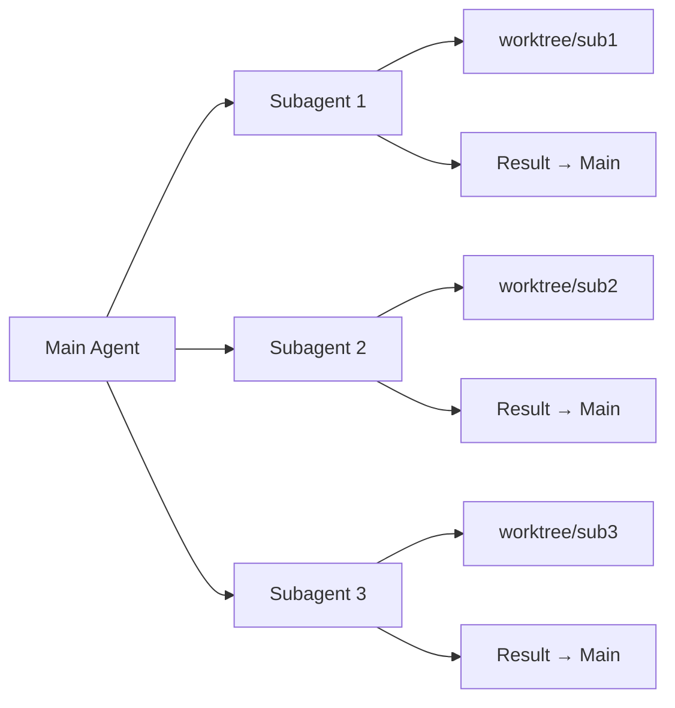

# Subagents

Subagents let the main agent delegate self-contained tasks to child agents, each with its own isolated worktree.

## How it works



## Delegation

The main agent creates subagents for:
- Independent file changes
- Parallel research tasks
- Testing and verification
- Documentation updates

## Configuration

```json
{
  "subagents": {
    "maxConcurrent": 4,
    "isolation": "worktree",
    "timeout": 300
  }
}
```

## Results

Subagent results are merged back into the main session:
- File changes are committed
- Outputs are captured in the conversation
- Errors are reported to the main agent

## Commands

| Command | Action |
|---|---|
| `/subagent create <task>` | Create a new subagent |
| `/subagent list` | List active subagents |
| `/subagent status <id>` | Check subagent status |
| `/subagent cancel <id>` | Cancel a subagent |
