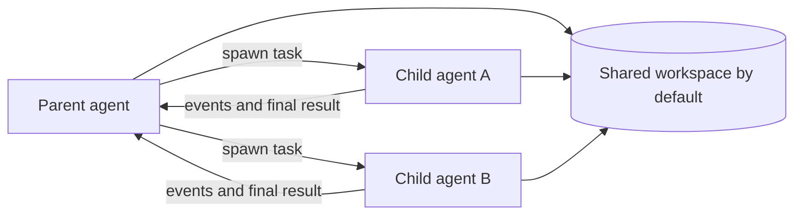
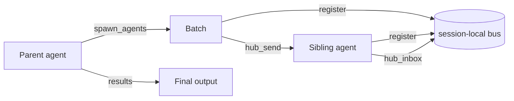

# Subagents

Subagents run self-contained tasks with isolated conversation context. They share the configured workspace unless a workflow explicitly creates a Git worktree, so delegation is not automatically file-isolated.



## Good delegation boundaries

Delegate work that is concrete, independently verifiable, and unlikely to overlap another writer: a focused investigation, one test suite, a bounded component, or a source review. Keep tightly coupled edits in one agent.

## Configuration

Use the flat bridge settings rather than a nested `subagents` object:

```json
{
  "maxParallelAgents": 4
}
```

The parent controls concurrency. Individual agent definitions can set their own model and turn limits. Child results and lifecycle events flow back to the parent, which remains responsible for integration and final verification.

## Commands and tools

- `/spawn <task>` starts a child task from the TUI.
- `/agents` (when contributed by the active capability set) shows child state.
- Programmatic agents use the registered delegation tools to spawn, message, interrupt, or wait for children.

## Inter-subagent coordination

When `spawn_agents` runs multiple children concurrently, they share a session-local message bus that enables direct peer-to-peer communication. Each child receives four built-in tools:

- **`hub_send`** — Deliver a message to a specific sibling agent or broadcast to all (`"*"`).
- **`hub_wait`** — Block until messages arrive from specified sibling agent IDs.
- **`hub_jobs`** — List all registered sibling agents and their current status.
- **`hub_inbox`** — Drain the agent's incoming message queue.

The bus is created automatically when `spawn_agents` executes. It is scoped to that single `spawn_agents` call, so sibling agents from different batch invocations never see each other. Parent agents and agents spawned via `spawn_agent` (singular) do not participate in the bus.



Do not assume a child committed changes or used a worktree unless the task explicitly required and verified that workflow.
