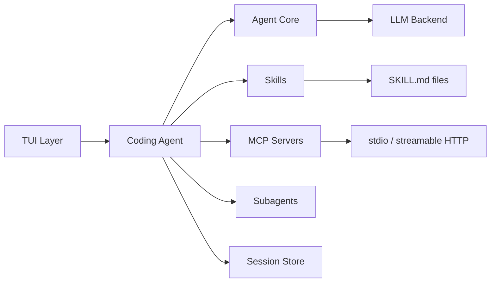

# Logician

A local-first coding agent with a streaming terminal UI. SSH-ready, thinking-visible, and built for real code editing workflows.

Logician turns natural-language instructions into inspectable code changes with streamed progress, session persistence, and skill-based extensibility. It works with local or hosted OpenAI-compatible model endpoints.

<div class="hero-actions">
  <a class="md-button md-button--primary" href="/docs/getting-started">Get Started</a>
  <a class="md-button" href="/docs/guides/overview">Read the Guides</a>
  <a class="md-button" href="https://github.com/lseman/logician">View on GitHub</a>
</div>

## Features

- **Terminal-native** — works over SSH, in tmux, in any VT100-compatible terminal
- **Streaming responses** — see reasoning, tool progress, and results as they happen
- **Safe edits** — strict text matching, CRLF/BOM preservation, path normalization
- **Skills & plugins** — `SKILL.md`-driven capabilities, Claude-style lifecycle hooks
- **Subagents** — delegate bounded tasks to child agents
- **Optional structured reasoning** — SSR, Tree of Thoughts, Reflexion, and more
- **Session management** — persistence, bookmarks, branching, rewind checkpoints, compaction
- **Cross-session memory** — persistent observations, lessons, and action tracking
- **MCP support** — stdio and streamable HTTP MCP servers
- **Permission modes** — `acceptAll`, `acceptEdits`, `ask`, `plan`

## Quick Start

```bash
git clone https://github.com/lseman/logician.git
cd logician
bun install
bun start
```

The TUI connects to an OpenAI-compatible backend at `http://127.0.0.1:8080` by default. Configure it in `~/.logician/settings.json`, a trusted project's `.logician.json`, or via `LOGICIAN_LLM_URL`.

## Architecture at a glance



## What can it do?

| Capability | Description |
|---|---|
| Code editing | Safe, verified edits with exact text matching |
| Reasoning | Tree of Thoughts, SSR, Reflexion, Auto-CoT |
| Session persistence | Full history, branching, rewind, compaction |
| Skills | `SKILL.md`-driven capabilities loaded automatically |
| Subagents | Delegate tasks to child agents |
| MCP integration | Tool extension via MCP servers |
| Headless mode | JSONL streaming for CI/CD pipelines |
