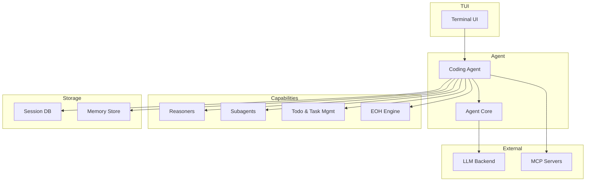

# Overview

Logician is a local-first coding agent built on a modular architecture. This page explains how the pieces fit together.

## Design philosophy

- **No cloud dependency** — everything runs locally. The LLM is called via an OpenAI-compatible API, but all reasoning, sessions, and tool execution happen on your machine.
- **Streaming-first** — every token, tool call, and reasoning step is visible in real time. No black-box prompts.
- **Safe by default** — edits use strict exact-text matching with CRLF/BOM preservation. Permission modes control how aggressively the agent acts.
- **Extensible** — skills (`SKILL.md` files), plugins, and MCP servers extend capabilities without code changes.

## Component architecture

### Core packages

| Package | Responsibility |
|---|---|
| `agent-core` | Agent loop, backend, configuration, compaction, hooks, tools |
| `coding-agent` | System prompt, skills loading, sessions, trust model, TUI utilities |
| `agent-capabilities` | Reasoners (ToT, SSR, Reflexion), subagents, todo management, EOH |
| `tui` | Terminal UI components, engine, layers, state management |

### Key concepts

- **Agent loop** — the core cycle: receive input → build system prompt → call LLM → parse response → execute tools → repeat.
- **Skills** — `SKILL.md` files that inject specialized instructions into the system prompt when triggered.
- **Hooks** — lifecycle callbacks (before/after tool calls, before/after LLM requests, etc.) for plugins.
- **Sessions** — persistent conversation history stored in SQLite, with support for bookmarks, branching, and compaction.
- **Trust model** — permission modes (`acceptAll`, `acceptEdits`, `ask`, `plan`) control agent behavior.

## Why local-first?

Cloud-dependent agents have a single point of failure and leak your code to third parties. Logician runs entirely on your machine — the LLM call is the only external network request, and even that goes to an endpoint you configure.

This means:
- Your code never leaves your machine
- No API key stored in a cloud service
- Works offline (except for LLM calls)
- Full control over data retention and session history
